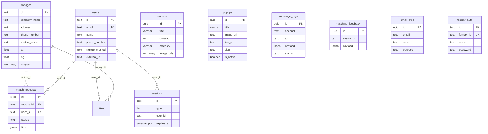

# 2-1. DB 스키마 문서

## 개요

- **DBMS:** PostgreSQL (Supabase 호스팅)
- **접근 방식:** `@supabase/supabase-js` (런타임), Prisma는 스키마 참고용
- **RLS:** 일부 테이블 활성화 — 서버는 `SUPABASE_SERVICE_ROLE_KEY`로 RLS 우회

---

## ERD (Entity Relationship Diagram)



---

## 핵심 테이블: `donggori` (봉제공장)

> 관리자 API `/api/admin/factories/schema`로 실시간 컬럼 목록 조회 가능.

| 컬럼 (대표) | 타입 | 설명 |
|-------------|------|------|
| `id` | text/uuid | PK |
| `company_name` | text | 업장명 |
| `address` | text | 주소 |
| `admin_district` | text | 행정동 |
| `business_type` | text | 업종 |
| `factory_type` | text | 공장 유형 (봉제, 샘플 등) |
| `contact_name` | text | 담당자 |
| `phone_number` | text | 연락처 |
| `email` | text | 이메일 |
| `intro` | text | 소개 |
| `moq` | numeric | 최소주문량 |
| `monthly_capacity` | numeric | 월 생산량 |
| `main_fabrics` | text | 주요 원단 |
| `distribution` | text | 유통 |
| `delivery` | text | 배송 |
| `equipment` | text | 장비 |
| `sewing_machines` | text | 재봉틀 |
| `pattern_machines` | text | 패턴기 |
| `special_machines` | text | 특수 기계 |
| `top_items_upper` ~ `top_items_pet` | text | 생산 품목 카테고리별 |
| `processes` | text | 공정 |
| `lat`, `lng` | float | 좌표 |
| `image` | text | 대표 이미지 URL |
| `images` | text[] | 이미지 URL 배열 |
| `kakao_url` | text | 카카오 채널 |
| `established_year` | text | 설립년도 |
| `created_at`, `updated_at` | timestamptz | 생성/수정일 |

**데이터 규모:** 약 328건 (2026-06 기준, `희망사` 제외)

---

## 테이블: `users`

| 컬럼 | 타입 | 제약 | 설명 |
|------|------|------|------|
| `id` | text | PK | 사용자 ID |
| `email` | text | UNIQUE | 이메일 |
| `name` | text | | 이름 |
| `phone_number` | text | | 전화번호 |
| `password` | text | nullable | bcrypt 해시 |
| `signup_method` | text | | email, kakao, naver, google |
| `external_id` | text | nullable | 소셜 ID |
| `kakao_message_consent` | boolean | | 알림톡 수신 동의 |
| `created_at` | timestamptz | | |

---

## 테이블: `sessions`

| 컬럼 | 타입 | 설명 |
|------|------|------|
| `id` | text PK | 세션 토큰 |
| `type` | text | `local` \| `sns` |
| `user_id` | text | |
| `user_email` | text | |
| `external_id` | text | |
| `provider` | text | kakao, naver, google |
| `expires_at` | timestamptz | |
| `created_at` | timestamptz | |

인덱스: `idx_sessions_user_email`

---

## 테이블: `popups`

| 컬럼 | 타입 | 제약 | 설명 |
|------|------|------|------|
| `id` | uuid | PK | |
| `title` | varchar(255) | NOT NULL | |
| `content` | text | | |
| `image_url` | text | | |
| `link_url` | text | | PC 클릭 URL |
| `link_url_mobile` | text | | 모바일 URL (선택) |
| `slug` | text | UNIQUE (partial) | 시드 식별자 |
| `sort_order` | integer | | 노출 순서 |
| `start_at`, `end_at` | date | | 노출 기간 |
| `is_active` | boolean | default true | |
| `created_at`, `updated_at` | timestamptz | | |

인덱스: `idx_popups_active`, `idx_popups_dates`, `idx_popups_slug`

---

## 테이블: `notices`

| 컬럼 | 타입 | 설명 |
|------|------|------|
| `id` | uuid PK | |
| `title` | varchar(255) NOT NULL | |
| `content` | text | |
| `category` | varchar(50) | 공지, 일반, 채용공고 |
| `image_urls` | text[] | |
| `start_at`, `end_at` | date | |
| `is_active` | boolean | |
| `created_at`, `updated_at` | timestamptz | |

---

## 테이블: `match_requests` (작업지시서/매칭)

| 컬럼 | 타입 | 설명 |
|------|------|------|
| `id` | uuid PK | |
| `factory_id` | text FK → donggori | |
| `user_id` | text | 의뢰자 |
| `brand_name` | text | |
| `contact_name`, `contact_info` | text | |
| `sample_status`, `pattern_status` | text | 보유/미보유 |
| `qc_required`, `finishing_required`, `packaging_required` | text | |
| `files`, `links` | jsonb/text[] | 첨부 |
| `status` | text | pending, accepted, rejected, completed |
| `created_at`, `updated_at` | timestamptz | |

---

## 테이블: `message_logs`

알림톡/SMS 발송 이력. `docs/db-migration-sql.md` 참조.

---

## 테이블: `matching_feedback`

AI 매칭 피드백 저장.

---

## 테이블: `email_otps`

이메일 OTP 인증 코드.

---

## 테이블: `factory_auth`

공장 사장님 로그인 (레거시). `scripts/factory_auth.sql` 참조.

---

## Prisma 스키마 (`prisma/schema.prisma`)

런타임 미사용. 참고용 모델:

- `User`, `FactoryAuth`, `PhoneOtp`

---

## 마이그레이션 적용 순서 (신규 환경)

```bash
# Supabase SQL Editor에서 순서대로 실행
1. scripts/create_admin_tables.sql
2. scripts/add_popup_link_url.sql
3. scripts/add_popup_slug.sql
4. scripts/add-category-to-notices.sql
5. scripts/add-image-urls-to-notices.sql
6. scripts/create-email-otps-table.sql
7. docs/db-migration-sql.md 내 sessions, message_logs 등
8. scripts/factory_auth.sql (공장 로그인 필요 시)
9. scripts/seed_default_popups.sql (선택)
```

데이터 적재: `scripts/importFactoriesFromXlsx.js` 또는 CSV import 스크립트.

---

## 관계 정의 요약

| 관계 | 설명 |
|------|------|
| users → sessions | 1:N 세션 |
| users → match_requests | 1:N 의뢰 |
| donggori → match_requests | 1:N 수신 의뢰 |
| popups, notices | 독립 콘텐츠 테이블 |

---

## 인덱스 및 제약조건

- `popups.slug` — UNIQUE (WHERE slug IS NOT NULL)
- `users.email` — UNIQUE (Supabase/앱 레벨)
- `factory_auth.factory_id` — UNIQUE
- 날짜/활성 필터용 복합 인덱스 — `create_admin_tables.sql` 참조

RLS 정책은 Supabase Dashboard에서 재확인 필요. 서버 API는 Service Role로 접근.
