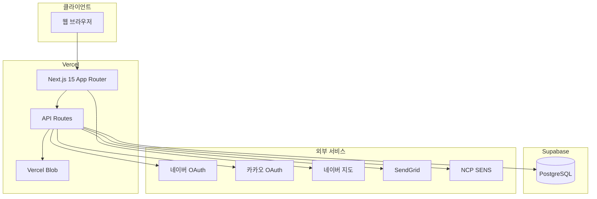

# 2-4. 환경 및 인프라 문서

## 1. 운영 환경 아키텍처

---

## 2. 서버 구성

| 항목 | 값 |
|------|-----|
| 호스팅 | Vercel (Serverless) |
| 프레임워크 | Next.js 15.3.6 |
| 별도 백엔드 | 없음 |
| 크론/워커 | 없음 |

### 도메인

| 도메인 | 용도 |
|--------|------|
| `www.donggori.com` | 운영 canonical URL |
| `donggori.com` | apex → www 308 리다이렉트 |
| `donggori.kr`, `www.donggori.kr` | www.donggori.com으로 308 리다이렉트 |

`NEXT_PUBLIC_SITE_URL=https://www.donggori.com`

---

## 3. 데이터베이스

| 항목 | 값 |
|------|-----|
| 제공자 | Supabase PostgreSQL |
| 서버 접근 | `SUPABASE_SERVICE_ROLE_KEY` |
| 클라이언트 | `NEXT_PUBLIC_SUPABASE_URL` + `ANON_KEY` |

핵심 테이블: `donggori`, `users`, `sessions`, `notices`, `popups`, `match_requests`

상세: [02-DB-스키마.md](./02-DB-스키마.md)

---

## 4. 스토리지

| 서비스 | 용도 | 환경 변수 |
|--------|------|-----------|
| Vercel Blob | 이미지 (기본) | `BLOB_READ_WRITE_TOKEN` |
| AWS S3 | 선택 (미사용 가능) | `IMAGE_SERVICE=aws-s3` |

---

## 5. 외부 서비스

| 서비스 | 용도 |
|--------|------|
| 네이버 OAuth | 소셜 로그인 |
| 카카오 OAuth | 소셜 로그인 |
| 네이버 지도 | 공장 찾기 지도 |
| SendGrid | 이메일 OTP (`EMAIL_PROVIDER=sendgrid`) |
| NCP SENS | SMS/알림톡 (`SMS_PROVIDER=ncp_sens`) |
| Vercel Analytics | 접속 분석 |

---

## 6. 인증

커스텀 쿠키 세션 + Supabase `sessions` 테이블

- 사용자: `session` / 카카오·네이버 쿠키
- 관리자: `admin_session` (HMAC, 24h)
- 공장: `factory_session` (HMAC, 14일)

---

## 7. 보안

- HTTPS: Vercel 자동 TLS
- `middleware.ts`: apex·`.kr` → `www.donggori.com` 리다이렉트
- 관리자 로그인 rate limit (15분 5회)
- Service Role Key는 서버 전용

---

## 8. 이전 시 필요 권한

- Vercel 프로젝트 Owner
- Supabase Project Owner
- Vercel Blob
- DNS (donggori.com)
- 네이버/카카오 OAuth 앱 관리자
